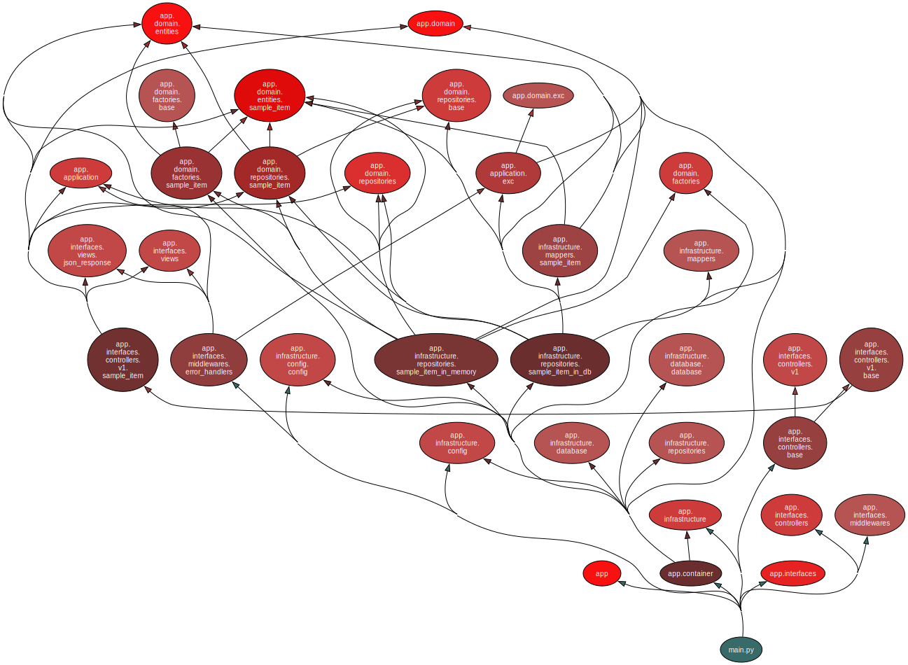

# FastAPI Web App Scaffold

## Overview

This system is a scaffold for developing web applications using FastAPI. It is designed with maintainability and
scalability in mind by implementing an architecture inspired by the principles of Onion Architecture. The system
decouples the core business logic from external dependencies, ensuring flexibility and ease of modification. The
application includes integration with SQLAlchemy for database handling, Alembic for migrations, and support for
containerized development with Docker. Additionally, it provides tools for testing, generating documentation, and
managing database schemas.

- [How to run](#how-to-run)
- [Run tests](#run-tests)
- [Architecture](#architecture)
- [Development](#development)
- [Documentation](#documentation)

## How to run

```bash
# Start
docker compose up -d

# Migration
docker compose exec app alembic upgrade head

# Load seed data
docker compose exec app python app/load_seeds.py

# Stop
docker compose down

# Delete DB
docker volume rm fast-api-web-app-scaffold_fawapp_postgresdb
```

## Run tests

TBD

## Architecture

### Concept

The architecture of this source code follows the concept illustrated in the diagram below.
This architecture is loosely based on the principles
of [Onion Architecture](https://jeffreypalermo.com/2008/07/the-onion-architecture-part-1/), which ensures
maintainability and
scalability of the code. By isolating the **Domain layer** as the independent core, we achieve:

- **Independence**: The business logic and entities are not influenced by external systems or frameworks, making the
  core reusable and testable.
- **Flexibility**: The **Application**, **Interfaces**, and **Infrastructure** layers can be modified or swapped without
  affecting the core logic.
- **Scalability**: Clear boundaries between layers support easier integration of new features and technologies in
  specific areas while keeping the overall system robust.
- **Maintainability**: Changes in UI, APIs, or database structures are decoupled from the business logic, minimizing the
  impact on other parts of the system.

** Direct dependencies from Interfaces or Infrastructure to Domain are also possible but are omitted here.

```
           +--------------------+
           |      Domain        |  <- Business Logic & Entities
           |  (Independent Core)|
           +--------------------+
                    ^
                    |
           +--------------------+
           |    Application     |  <- Use Case Implementation
           +--------------------+
               ^           ^
               |           |
+------------------+   +--------------------+
|    Interfaces    |   |   Infrastructure   |
| (UI, API, etc.)  |   | (DB, External APIs)|
+------------------+   +--------------------+
```

### Dependency graph



Generated by [pydeps](https://github.com/thebjorn/pydeps).

```bash
pydeps app/main.py --reverse --max-bacon 3 -x sqlalchemy fastapi starlette fastapi_pagination pytest pydantic pydantic_core jwt botocore freezegun boto3 pydantic_settings wheel setuptools sqlmodel dependency_injector asyncpg
```

## Development

### Add/Modify DB tables

1. Write/modify entity definitions using sqlmodel under app/domain/entities directory.
2. Start DB container: `docker compose up -d`
3. Generate migration script:
   `docker compose exec app alembic revision --autogenerate -m "comment like add some tables"`
4. Migrate: `docker compose exec app alembic upgrade head`

## Documentation

### DB schema document

Generated by [tbls](https://github.com/k1LoW/tbls).

```bash
# You need to delete the existing doc directory before running the below command.
rm -rf doc/db

# Generate the document.
tbls doc
```

```bash
# Generate schema document in xlsx format
tbls out -t xlsx -o schema.xlsx
```

### Documents

- API document: http://localhost/docs , http://localhost/redoc
- DB schema document: [/doc/db/README.md](/doc/db/README.md)
