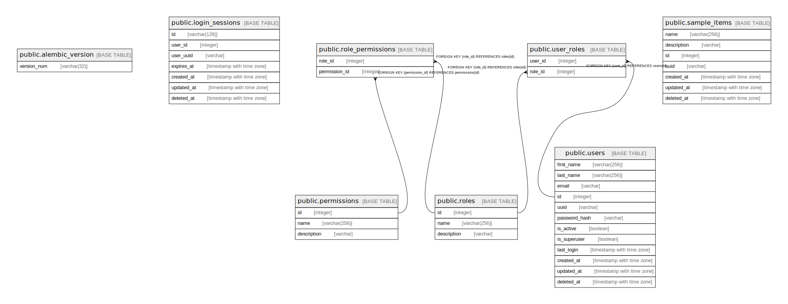

# fawapp_db

## Tables

| Name | Columns | Comment | Type |
| ---- | ------- | ------- | ---- |
| [public.alembic_version](public.alembic_version.md) | 1 |  | BASE TABLE |
| [public.login_sessions](public.login_sessions.md) | 7 |  | BASE TABLE |
| [public.permissions](public.permissions.md) | 3 |  | BASE TABLE |
| [public.roles](public.roles.md) | 3 |  | BASE TABLE |
| [public.sample_items](public.sample_items.md) | 7 |  | BASE TABLE |
| [public.users](public.users.md) | 12 |  | BASE TABLE |
| [public.role_permissions](public.role_permissions.md) | 2 |  | BASE TABLE |
| [public.user_roles](public.user_roles.md) | 2 |  | BASE TABLE |

## Relations

---

> Generated by [tbls](https://github.com/k1LoW/tbls)
