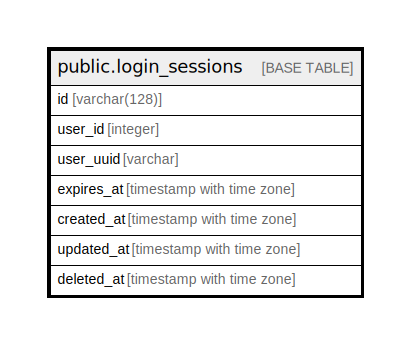

# public.login_sessions

## Description

## Columns

| Name | Type | Default | Nullable | Children | Parents | Comment |
| ---- | ---- | ------- | -------- | -------- | ------- | ------- |
| id | varchar(128) |  | false |  |  |  |
| user_id | integer |  | false |  |  |  |
| user_uuid | varchar |  | false |  |  |  |
| expires_at | timestamp with time zone |  | false |  |  |  |
| created_at | timestamp with time zone | now() | false |  |  |  |
| updated_at | timestamp with time zone | now() | false |  |  |  |
| deleted_at | timestamp with time zone |  | true |  |  |  |

## Constraints

| Name | Type | Definition |
| ---- | ---- | ---------- |
| login_sessions_pkey | PRIMARY KEY | PRIMARY KEY (id) |

## Indexes

| Name | Definition |
| ---- | ---------- |
| login_sessions_pkey | CREATE UNIQUE INDEX login_sessions_pkey ON public.login_sessions USING btree (id) |
| ix_login_sessions_id | CREATE INDEX ix_login_sessions_id ON public.login_sessions USING btree (id) |

## Relations

---

> Generated by [tbls](https://github.com/k1LoW/tbls)
