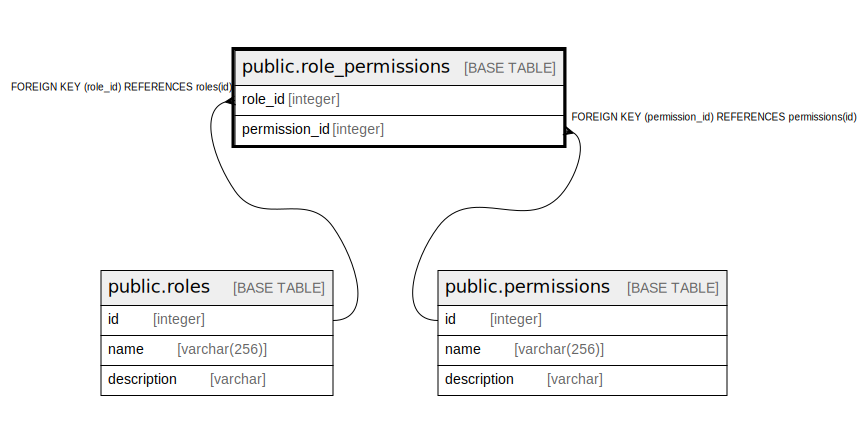

# public.role_permissions

## Description

## Columns

| Name | Type | Default | Nullable | Children | Parents | Comment |
| ---- | ---- | ------- | -------- | -------- | ------- | ------- |
| role_id | integer |  | false |  | [public.roles](public.roles.md) |  |
| permission_id | integer |  | false |  | [public.permissions](public.permissions.md) |  |

## Constraints

| Name | Type | Definition |
| ---- | ---- | ---------- |
| role_permissions_permission_id_fkey | FOREIGN KEY | FOREIGN KEY (permission_id) REFERENCES permissions(id) |
| role_permissions_role_id_fkey | FOREIGN KEY | FOREIGN KEY (role_id) REFERENCES roles(id) |
| role_permissions_pkey | PRIMARY KEY | PRIMARY KEY (role_id, permission_id) |

## Indexes

| Name | Definition |
| ---- | ---------- |
| role_permissions_pkey | CREATE UNIQUE INDEX role_permissions_pkey ON public.role_permissions USING btree (role_id, permission_id) |

## Relations

---

> Generated by [tbls](https://github.com/k1LoW/tbls)
