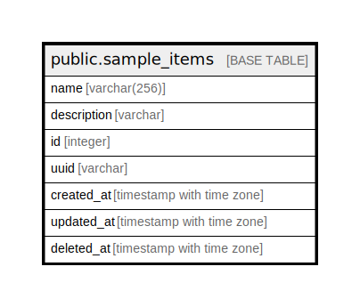

# public.sample_items

## Description

## Columns

| Name | Type | Default | Nullable | Children | Parents | Comment |
| ---- | ---- | ------- | -------- | -------- | ------- | ------- |
| name | varchar(256) |  | false |  |  | SampleItem name, comment for db |
| description | varchar |  | true |  |  | SampleItem description for db |
| id | integer | nextval('sample_items_id_seq'::regclass) | false |  |  |  |
| is_deleted | boolean |  | false |  |  |  |
| created_at | timestamp with time zone | now() | false |  |  |  |
| updated_at | timestamp with time zone | now() | true |  |  |  |
| deleted_at | timestamp with time zone |  | true |  |  |  |

## Constraints

| Name | Type | Definition |
| ---- | ---- | ---------- |
| sample_items_pkey | PRIMARY KEY | PRIMARY KEY (id) |

## Indexes

| Name | Definition |
| ---- | ---------- |
| sample_items_pkey | CREATE UNIQUE INDEX sample_items_pkey ON public.sample_items USING btree (id) |

## Relations

---

> Generated by [tbls](https://github.com/k1LoW/tbls)
