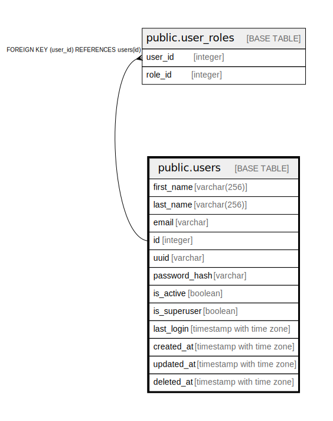

# public.users

## Description

## Columns

| Name | Type | Default | Nullable | Children | Parents | Comment |
| ---- | ---- | ------- | -------- | -------- | ------- | ------- |
| first_name | varchar(256) |  | true |  |  |  |
| last_name | varchar(256) |  | true |  |  |  |
| email | varchar |  | false |  |  |  |
| id | integer | nextval('users_id_seq'::regclass) | false | [public.user_roles](public.user_roles.md) |  |  |
| uuid | varchar |  | false |  |  | Short UUID generated by server |
| password_hash | varchar |  | false |  |  |  |
| is_active | boolean |  | false |  |  |  |
| is_superuser | boolean |  | false |  |  |  |
| last_login | timestamp with time zone |  | true |  |  |  |
| created_at | timestamp with time zone | now() | false |  |  |  |
| updated_at | timestamp with time zone | now() | false |  |  |  |
| deleted_at | timestamp with time zone |  | true |  |  |  |

## Constraints

| Name | Type | Definition |
| ---- | ---- | ---------- |
| users_pkey | PRIMARY KEY | PRIMARY KEY (id) |

## Indexes

| Name | Definition |
| ---- | ---------- |
| users_pkey | CREATE UNIQUE INDEX users_pkey ON public.users USING btree (id) |
| ix_users_email | CREATE UNIQUE INDEX ix_users_email ON public.users USING btree (email) |
| ix_users_id | CREATE INDEX ix_users_id ON public.users USING btree (id) |
| ix_users_uuid | CREATE UNIQUE INDEX ix_users_uuid ON public.users USING btree (uuid) |

## Relations

---

> Generated by [tbls](https://github.com/k1LoW/tbls)
